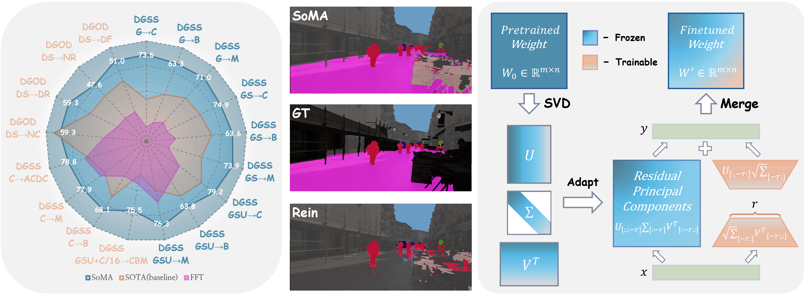

# [CVPR 2025] SoMA: Singular Value Decomposed Minor Components Adaptation for Domain Generalizable Representation Learning
Seokju Yun, Seunghye Chae, Dongheon Lee, Youngmin Ro

[](https://paperswithcode.com/sota/domain-adaptation-on-cityscapes-to-acdc?p=sora-singular-value-decomposed-low-rank) <br />	
[](https://paperswithcode.com/sota/domain-generalization-on-gta-to-avg?p=sora-singular-value-decomposed-low-rank) <br />

### [Project Page](https://ysj9909.github.io/SoRA.github.io/) | [arXiv](https://arxiv.org/abs/2412.04077)



<details>
  <summary>
  <font size="+1">Abstract</font>
  </summary>
Domain generalization (DG) aims to adapt a model using one or multiple source domains to ensure robust performance in unseen target domains. Recently, Parameter-Efficient Fine-Tuning (PEFT) of foundation models has shown promising results in the context of DG problem.
Nevertheless, existing PEFT methods still struggle to strike a balance between preserving generalizable components of the pre-trained model and learning task-specific features. To gain insights into the distribution of generalizable components, we begin by analyzing the pre-trained weights  through the lens of singular value decomposition. Building on these insights, we introduce Singular Value Decomposed Minor Components Adaptation (SoMA), an approach that selectively tunes minor singular components while keeping the residual parts frozen. SoMA effectively retains the generalization ability of the pre-trained model while efficiently acquiring task-specific skills. Furthermore, we freeze domain-generalizable blocks and employ an annealing weight decay strategy, thereby achieving an optimal balance in the delicate trade-off between generalizability and discriminability. SoMA attains state-of-the-art results on multiple benchmarks that span both domain generalized semantic segmentation to domain generalized object detection. In addition, our methods introduce no additional inference overhead or regularization loss, maintain compatibility with any backbone or head, and are designed to be versatile, allowing easy integration into a wide range of tasks.
</details>


<br>

**Important Notice**: The abbreviation for the method has been changed from `SoRA` to `SoMA`. However, please note that this change has not been reflected in the code.

<br>

```bibtex
@inproceedings{yun2024soma,
  title={SoMA: Singular Value Decomposed Minor Components Adaptation for Domain Generalizable Representation Learning},
  author={Yun, Seokju and Chae, Seunghye and Lee, Dongheon and Ro, Youngmin},
  booktitle={Proceedings of the IEEE/CVF Conference on Computer Vision and Pattern Recognition},
  year={2025}
}
```

## Domain Generalized Semantic Segmentation Performance (DINOv2)

|Setting |Crop Size |mIoU (Avg)|Config|Adapter&Head Checkpoint|
|:---:|:---:|:---:|:---:| :---:|
|GTAV $\rightarrow$ Cityscapes, BDD, Mapillary|512 |68.27|[config](https://github.com/ysj9909/SoMA/blob/main/configs/sora/sora_dinov2-L_mask2former.py)| [checkpoint](https://github.com/ysj9909/SoMA/releases/download/v1.0/soma_dinov2-L_g2cbm_best.pth)
|GTAV + Synthia $\rightarrow$ Cityscapes, BDD, Mapillary|512 |69.26|[config](https://github.com/ysj9909/SoMA/blob/main/configs/sora/sora_dinov2-L_mask2former_gs2cbm.py)| [checkpoint](https://github.com/ysj9909/SoMA/releases/download/v1.0/soma_dinov2-L_gs2cbm_best.pth)
|GTAV + Synthia + UrbanSyn $\rightarrow$ Cityscapes, BDD, Mapillary|512 |71.68|[config](https://github.com/ysj9909/SoMA/blob/main/configs/sora/sora_dinov2-L_mask2former_gsu2cbm.py)| [checkpoint](https://github.com/ysj9909/SoMA/releases/download/v1.0/soma_dinov2-L_gsu2cbm_best.pth)
|GTAV + Synthia + UrbanSyn $\rightarrow$ Cityscapes, BDD, Mapillary|1024 |73.12|[config](https://github.com/ysj9909/SoMA/blob/main/configs/sora/sora_dinov2-L_mask2former_gsu2cbm_1024x1024.py)| [checkpoint](https://github.com/ysj9909/SoMA/releases/download/v1.0/soma_dinov2-L_gsu2cbm_1024x1024_best.pth)
|GTAV + Synthia + UrbanSyn $\rightarrow$ 1/16 of Cityscapes $\rightarrow$ Cityscapes, BDD, Mapillary|1024 |75.50|[config](https://github.com/ysj9909/SoMA/blob/main/configs/sora/sora_dinov2-L_mask2former_gsuc16_2cbm_1024x1024.py)| [checkpoint](https://github.com/ysj9909/SoMA/releases/download/v1.0/soma_dinov2-L_data_efficiency_1024x1024_best.pth)
| Cityscapes $\rightarrow$ BDD, Mapillary|512 |71.74|[config](https://github.com/ysj9909/SoMA/blob/main/configs/sora/sora_dinov2_mask2former_c2bm.py)| [checkpoint](https://github.com/ysj9909/SoMA/releases/download/v1.0/soma_dinov2-L_c2bm_best.pth)
| Cityscapes $\rightarrow$ ACDC (test set)|1024 |[78.75](https://acdc.vision.ee.ethz.ch/submissions/66dc574130d48b1c5dc91b7a)|[config](https://github.com/ysj9909/SoMA/blob/main/configs/sora/sora_dinov2_mask2former_ACDC_1024x1024_bs4x2.py)| [checkpoint](https://github.com/ysj9909/SoMA/releases/download/v1.0/soma_dinov2-L_acdc_1024x1024_best.pth)


## Domain Generalized Object Detection Performance (DINOv2)

|Setting |Input Size|DS|NC|DR|NR|DF|Config|Adapter&Head Checkpoint|
|:---:|:---:|:---:|:---:| :---:| :---:| :---:| :---:| :---:|
|Clear to Adverse Weather|1024 |69.4|59.3|59.3|47.6|51.0|[config](https://github.com/ysj9909/SoMA/blob/main/DGOD/configs/sora/sora_dinov2-L_codetr_dg.py)| [checkpoint](https://github.com/ysj9909/SoMA/releases/download/v1.0/soma_dinov2-L_dgod_best.pth)

## Environment Setup
To set up your environment, execute the following commands:
```bash
conda create -n soma -y
conda activate soma
conda install pytorch==2.0.1 torchvision==0.15.2 torchaudio==2.0.2 pytorch-cuda=11.7 -c pytorch -c nvidia -y
pip install -U openmim
mim install mmengine
mim install "mmcv==2.0.0"
pip install "mmsegmentation>=1.0.0"
pip install "mmdet>=3.0.0"
pip install xformers=='0.0.20' # optional for DINOv2
pip install -r requirements.txt
pip install future tensorboard
pip install peft=='0.11.1'
pip install transformers=='4.42.4'
```

## Dataset Preparation
The dataset preparation process follows the procedures of [Rein](https://github.com/w1oves/Rein) for DGSS and [Diverse Weather](https://github.com/AmingWu/Single-DGOD) for DGOD. Please refer to the respective repositories for details.


## Transform Pre-trained Weights
* **Download:** Download pre-trained weights from [facebookresearch](https://dl.fbaipublicfiles.com/dinov2/dinov2_vitl14/dinov2_vitl14_pretrain.pth) for testing. Place them in the project directory without changing the file name.
* **Convert:** Convert pre-trained weights for training or evaluation.
  ```bash
  python tools/convert_models/convert_dinov2_sora.py checkpoints/dinov2_vitl14_pretrain.pth checkpoints/dinov2_sora_converted.pth
  ```
  (optional for 1024x1024 resolution)
  ```bash
  python tools/convert_models/convert_dinov2_sora.py checkpoints/dinov2_vitl14_pretrain.pth checkpoints/dinov2_sora_converted_1024x1024.pth --height 1024 --width 1024
  ```

###  Using Our Trained Checkpoints
To use or evaluate our trained checkpoint, you must **merge** the provided **SoMA adapter & decode head weights** with one of the following backbone checkpoints:

- `checkpoints/dinov2_sora_converted.pth`  
- `checkpoints/dinov2_sora_converted_1024x1024.pth`

Please use the script [`tools/merge_soma_weights.py`](tools/merge_soma_weights.py) to perform this merging process:
```bash
python tools/merge_soma_weights.py --backbone_ckpt checkpoints/dinov2_sora_converted.pth --soma_ckpt checkpoints/soma_checkpoints/soma_dinov2-L_g2cbm_best.pth --merged_ckpt checkpoints/merged_checkpoints/soma_dinov2-L_g2cbm_best.pth
  ```
For 1024x1024 crop size,
```bash
python tools/merge_soma_weights.py --backbone_ckpt checkpoints/dinov2_sora_converted_1024x1024.pth --soma_ckpt checkpoints/soma_checkpoints/soma_dinov2-L_gsu2cbm_1024x1024_best.pth --merged_ckpt checkpoints/merged_checkpoints/soma_dinov2-L_gsu2cbm_1024x1024_best.pth
  ```

---

To extract the **adapter and decode head weights** from a trained model, please refer to the script [`tools/extract_soma_weights.py`](tools/extract_soma_weights.py).

## Evaluation
  Run the evaluation:
  ```
  python tools/test.py /path/to/cfg /path/to/checkpoint
  ```

## Training
Start training in single GPU:
```
python tools/train.py /path/to/cfg
```
Start training in multiple GPU:
```
PORT=12345 CUDA_VISIBLE_DEVICES=1,2,3,4 bash tools/dist_train.sh /path/to/cfg NUM_GPUS
```

## Acknowledgements
We sincerely appreciate [mmsegmentation](https://github.com/open-mmlab/mmsegmentation), [mmdetection](https://github.com/open-mmlab/mmdetection), [Rein](https://github.com/w1oves/Rein), [Single-DGOD](https://github.com/AmingWu/Single-DGOD), and [peft](https://github.com/huggingface/peft) for their wonderful implementations.
